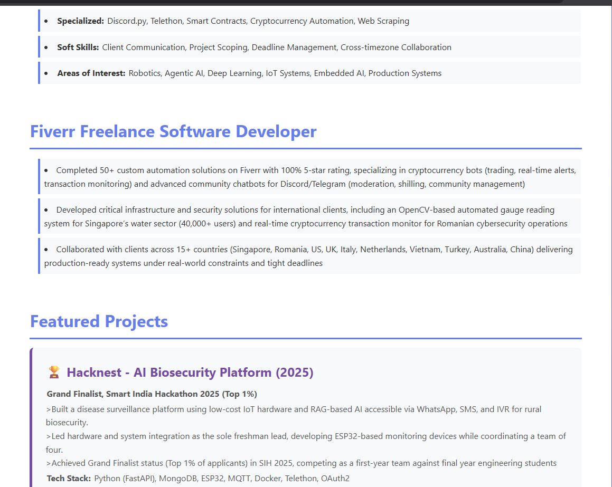
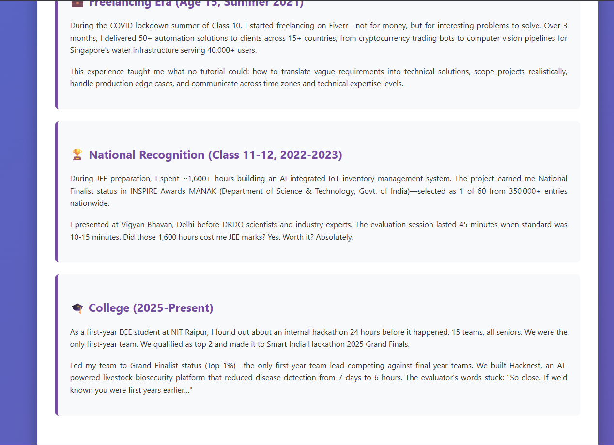
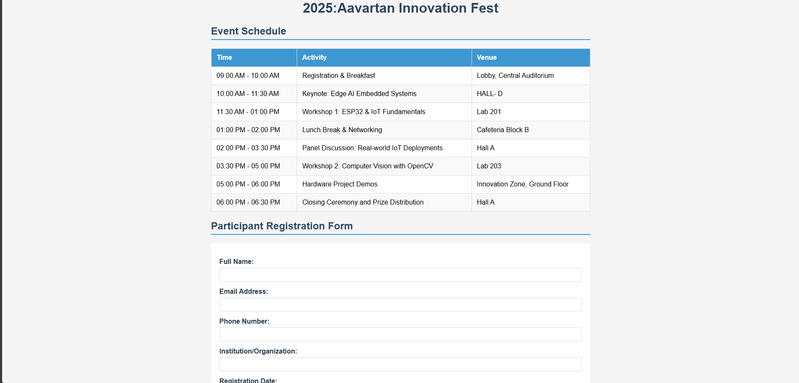
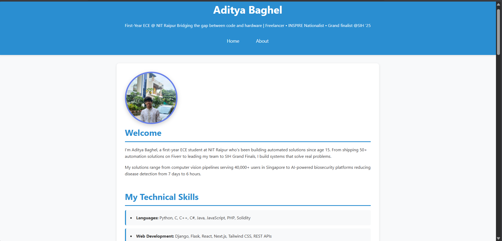

# 30days-of-code-2026
This is a 30-day code challenge 2026 at NIT RAIPUR
Day 1: Built a multi-page semantic HTML portfolio featuring navigation, embedded media, project showcases, and structured content.

completed the submission on 1 jan 2026

Day 2:Developed a complete event registration page with a structured schedule and a comprehensive, accessible form.

completed the submission on 2 jan 2026

Day 3:Created external stylesheet (style.css) and linked across all pages. back from the portfolio page
