# 30days-of-code-2026
This is a 30-day code challenge 2026 at NIT RAIPUR
Day 1: Built a multi-page semantic HTML portfolio featuring navigation, embedded media, project showcases, and structured content.
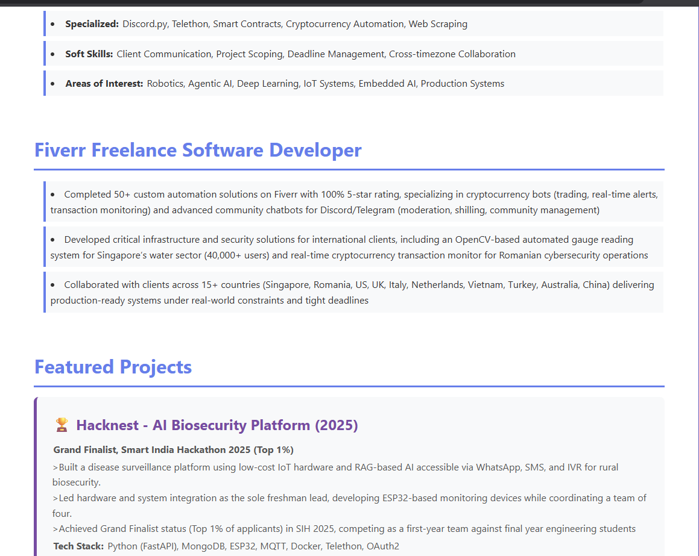
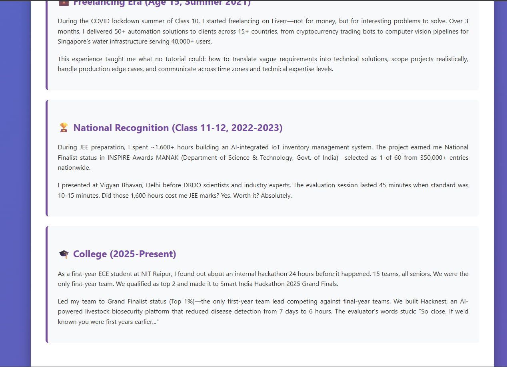
completed the submission on 1 jan 2026

Day 2:Developed a complete event registration page with a structured schedule and a comprehensive, accessible form.
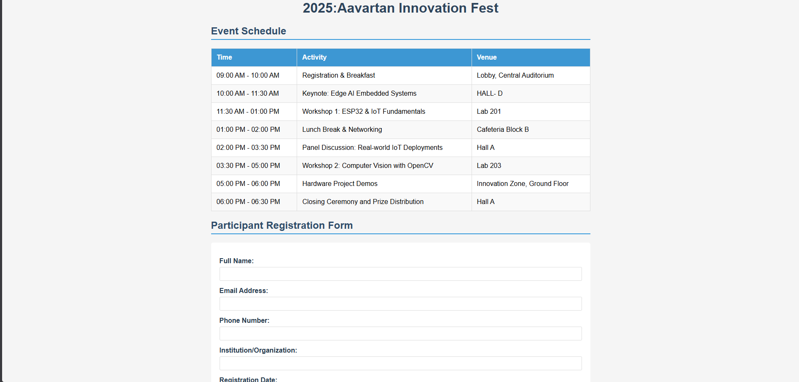
completed the submission on 2 jan 2026

Day 3:Created external stylesheet (style.css) and linked across all pages. back from the portfolio page
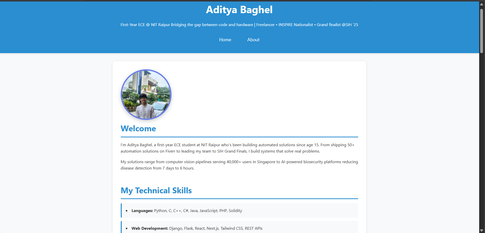

Day 4:Responsive Landing Page, Sticky Navigation, CSS Animations, Flexbox Layouts, Interactive Pricing Tiers, Smooth Scrolling.
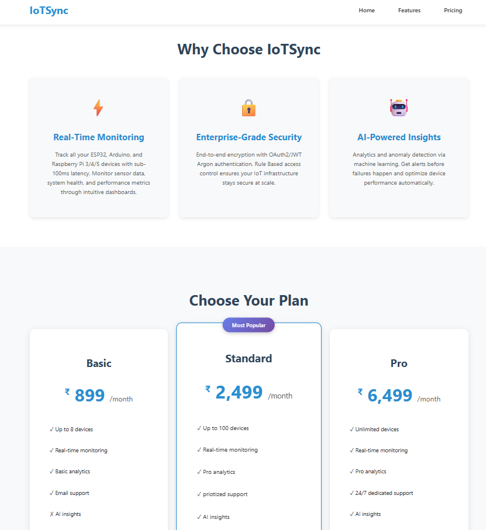

Day 5: Interactive Tic Tac Toe with animated & SVG graphics, confetti win effects, score tracking, glassmorphism UI, and smooth CSS animations using custom Google Fonts.

Day 6: What is the worst case time complexity of the following code:
O(2^(R + C))
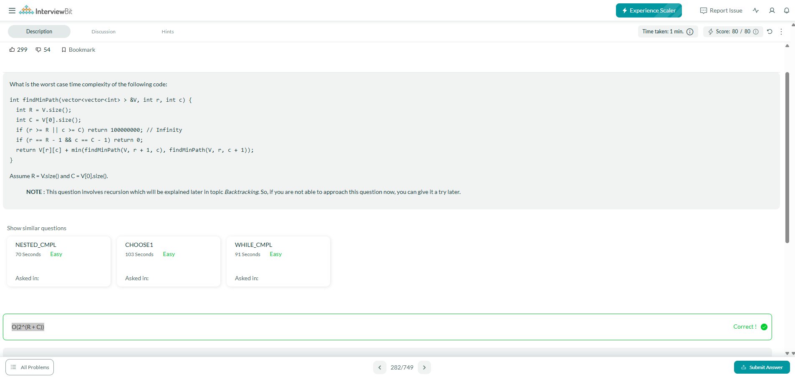

Day 7:Find the Sum of Encrypted Integers
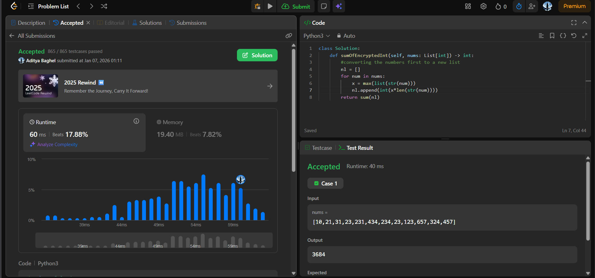
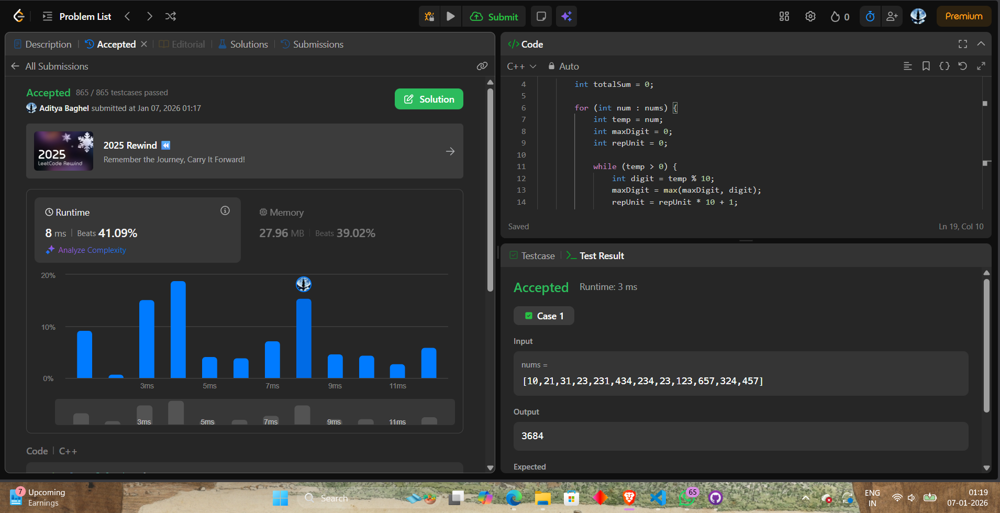

Day 8: longest consecutive sequence
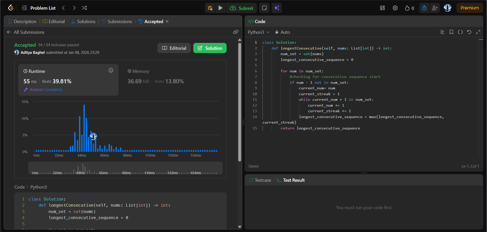

Day9: Largest odd possible number
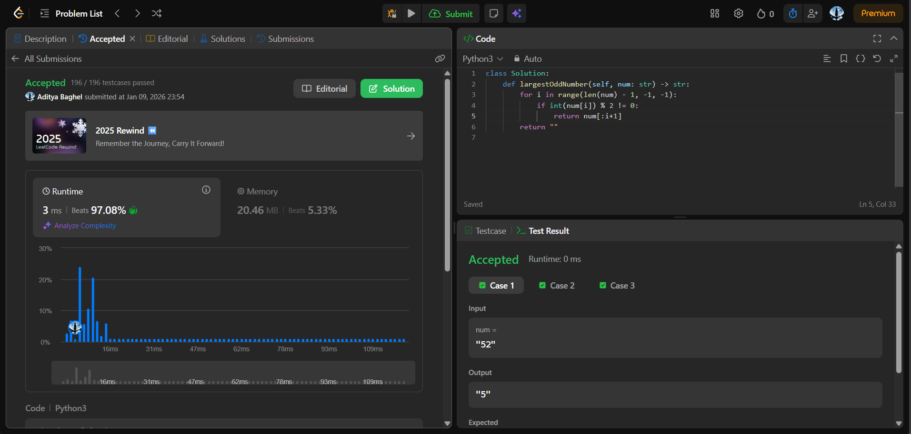

Day10: sorting 0 1 2
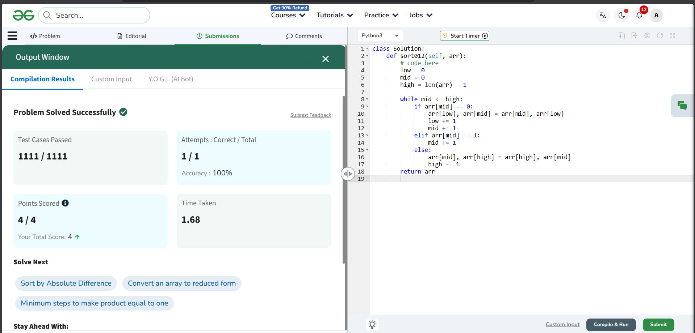

Day11: merge sorting
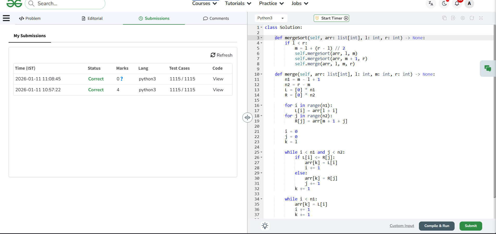